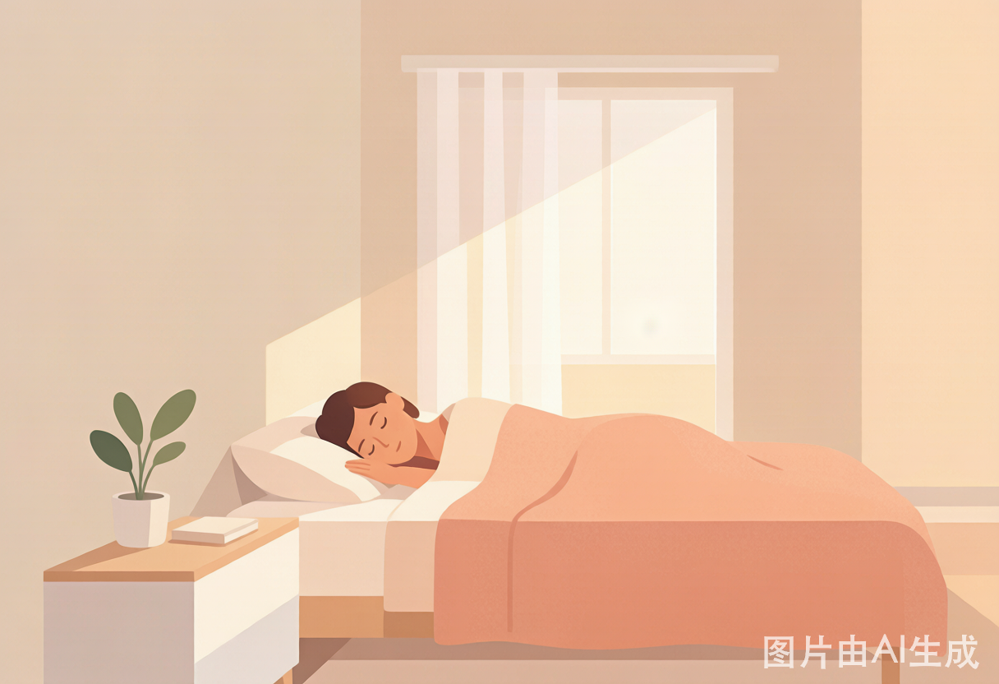
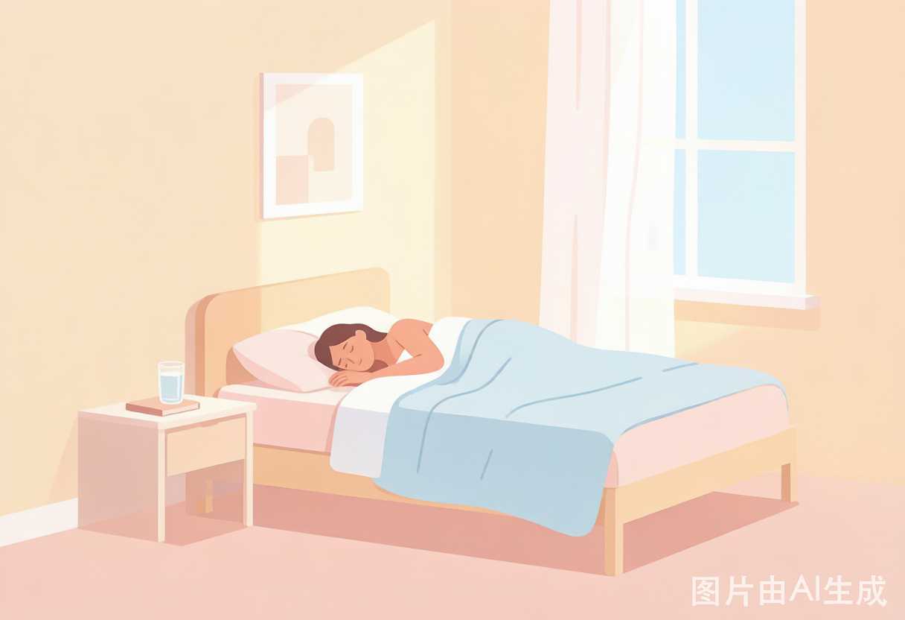
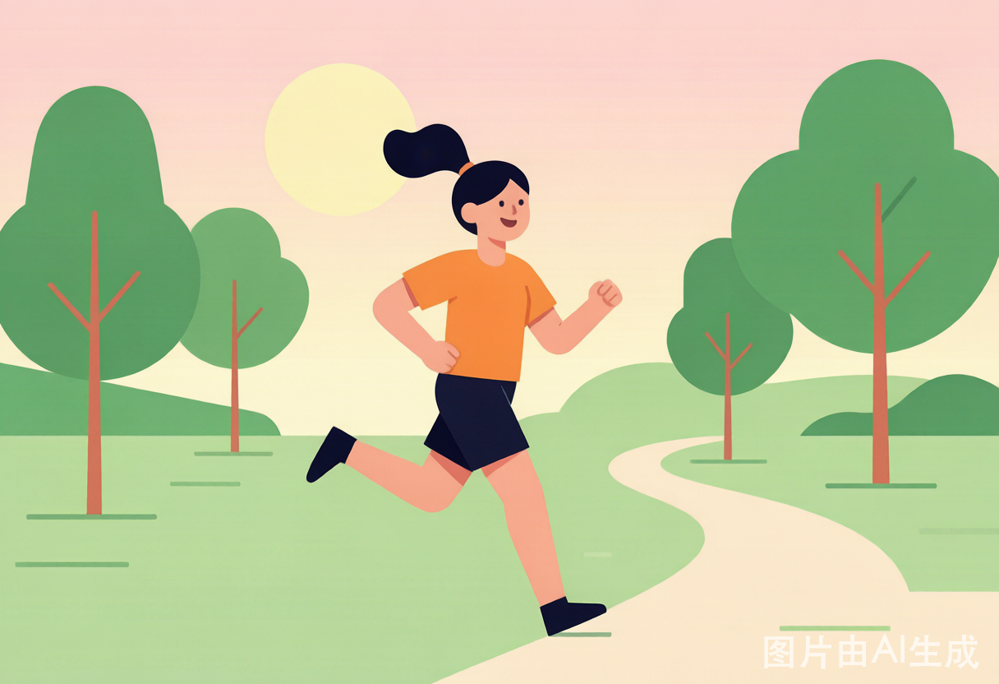

健康从来不是某一天突然的“逆袭”，而是藏在日常里的点点滴滴。不必节食到头晕，也无需把健身房当第二个家——只要把下面这三件小事稳稳接住，身体就会悄悄给你正向的反馈。

**第一件事，是睡个好觉。** 睡眠是身体自我修复的黄金时间，免疫、记忆、情绪都在这几个钟头里悄悄“充电”。尽量固定作息，睡前少刷手机，把卧室调暗调静，让身体记住“该休息了”的信号。哪怕只是比昨天早睡二十分钟，长期下来也是一笔可观的健康存款。

**第二件事，是吃得均衡。** 健康饮食的关键不在于“戒掉一切”，而在于搭配得当：蔬菜瓜果占一半，优质蛋白和全谷物补齐另一半，少油少糖、多喝水。不必顿顿精算热量，只要盘子里颜色丰富、种类多样，身体就能拿到它真正需要的养分。

**第三件事，是动起来。** 运动不一定要挥汗如雨，散步、骑车、拉伸、爬楼梯，都是身体喜欢的“小确幸”。每天留二三十分钟给活动，血液循环更顺畅，心情也更轻盈。把运动嵌进生活节奏里，而不是当成任务，才最容易坚持下去。

睡好、吃对、动起来——三件小事，日积月累，就是留给未来自己最好的礼物。
